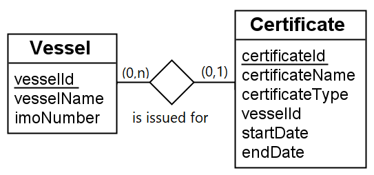

# VesselSearch Backend #
This is the backend for the VesselSearch application. Together with the frontend, it allows the user to search for vessels in the database and view their details. The backend is written in Java Spring Boot, and the frontend is written in React, implemented with Typescript. The database is a MySQL database, and currently the frontend has no post functionality, so the database must be created and populated with data through Postman or direct inserts.

See the README.md in the frontend folder for more information about the frontend. [Link to the Frontend Repository for this project.](https://github.com/erlenelo/VesselSearch-Frontend)

## VesselSearch ##
As a whole, this application is a search engine for vessels. The user can search for vessels by name, substring of name, or imoNumber, and the application will return a list of vessels that match the search term. Any certificates issued for the vessel is also displayed in the card. 

The application itself was developed as a part of a coding case issued by Skuld Assurance. The following requirements were given:
* The application should be able to search for vessels by name, substring of name, or imoNumber.
* The application should be able to display the vessel details, including the vessel name, imoNumber, and all certificates issued for the vessel.
* The application must use Java Spring Boot for the backend. Other technology choices are up to the developer.

ER diagram of the database:



Note that vesselId is foreign key in the certificate table, allowing for a one-to-many relationship between vessels and certificates, where a vessel can have many certificates, but a certificate can only be issued for one vessel. This means that retreiving a vessel from the database will also return all certificates issued for that vessel.

## How to run the application ##
- Ensure that you have Java 11 installed, and that you have a MySQL database running on port 3306. The database must be created initially, and you can use Postman to add vessels and corresponding certificates to the database, or insert directly in the database. 

Below are available endpoints:
### Add certificate to a vessel (POST)###
```sh
localhost:8080/certificate/add
```
JSON-body example:
```sh
{
    "certificateId": 1,
    "certificateName": "BC - name of certificate",
    "certificateType": "BC",
    "vessel": {
        "vesselId": 1
    },
    "startDate": "2020-01-01",
    "endDate": "2020-12-31"
}
```
The vesselId in the JSON format specifies which vessel the certificate is issued for.

### Add vessel (POST)###
```sh
localhost:8080/vessel/add
```
JSON-body example:
```sh
{
    "vesselId": 1,
    "vesselName": "Vessel 1",
    "imoNumber": 1234567
}
```

### Get all vessels with respective their certificates (GET) ###
```sh
localhost:8080/vessel/getAllWithCertificates
```

### Get vessel by ImoNumber or vesselName/substring of vesselName (GET) ###
```sh
localhost:8080/vessel/search?searchTerm={searchTerm}
```

The searchTerm is a string that can be used to search for vessels. The search is done on the vesselName and imoNumber fields. The search is case insensitive, and the searchTerm can be a substring of the vesselName. ImoNumber must be an exact match.

All endpoints can be tested with Postman. Only the GET endpoint can be tested in the browser, the POST endpoints must be done through Postman.

Once you have a database running, and have added some relevant data, you can run the backend by running the following command in the backend folder:
```sh
cd vesselsearch
mvn spring-boot:run
```
The backend will then run on port 8080.
Proceed to the frontend folder, Do the following:
```sh
npm install
npm start
```
